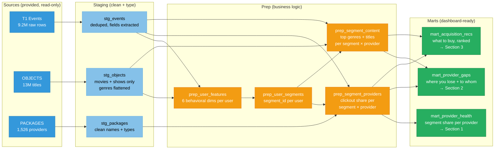
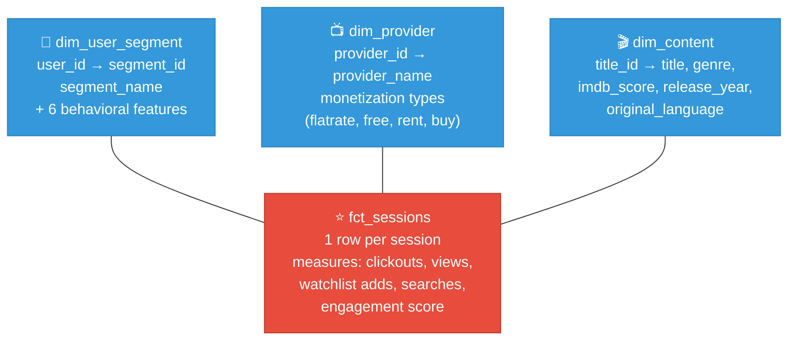
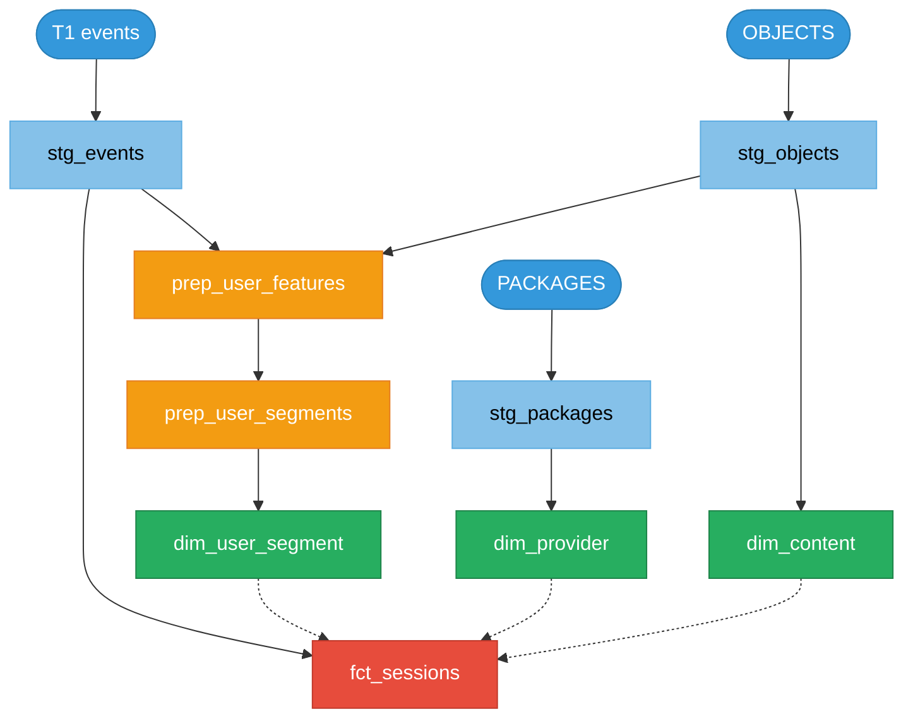
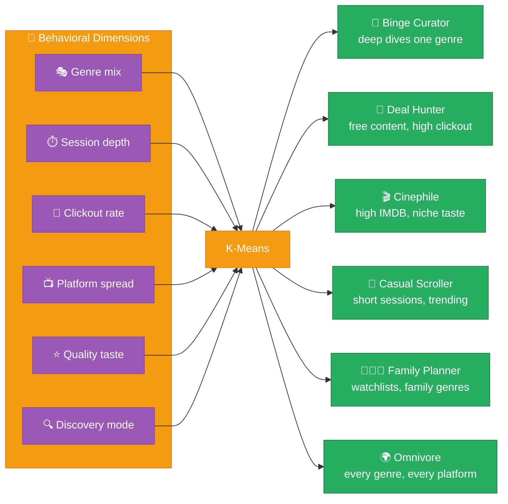
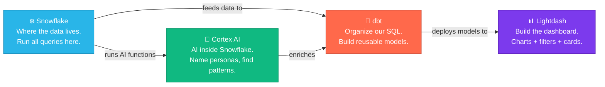

# Ghost Content Discovery

## The Goal
JustWatch is uniquely positioned to understand demand and supply of movie content across providers. The is a huge commercial opportunity in providing that intelligence back to the movie platforms by surfacing anonymized analytics on that content types are under served by one particular provider, given by user behavior on other providers.

## Development setup
1. Create a new python virtual environment
```
uv venv && source .venv/bin/activate
```
2. Install dependencies
```
uv pip install -r requirements.txt
```
3. Create a copy of the `.env.example` and fill it with your Snowflake credentials
4. Load all environment variables into your terminal
```
source .env
```
5. Verify that your dbt connection works
```
source .venv/bin/activate
cd platforms/dbt/dbt_template
dbt debug
```

# Project Description for Ghost Content Discovery (Streaming Audience Intelligence)

> **Challenges**: #5 (Audience Segmentation) + #2 (Content Discovery)
> **Team**: 6 people, 8 hours

---

## Problem

JustWatch has millions of users clicking, searching, and browsing every day. That's just raw data. Nobody can answer:

- **What types of viewers exist?** (Not age/gender — actual behavior)
- **What does each type want to watch?**
- **Which providers are missing content that specific user groups want?**

## Solution

Sort users into **groups based on behavior** ("binge watchers," "bargain hunters"). Then for each group, find **what they watch on which platform** — and where the gaps are.

The key insight: if a user cluster watches a lot of sci-fi on Amazon Prime but searches for sci-fi on Netflix and can't find it — that's a **gap recommendation**:

> *"Hey Netflix, you're losing Sci-Fi Binge Watchers to Amazon Prime. They're searching for this content on your platform but can't find it. Here's what to add."*

## Output

A dashboard built for a **content buyer at a streaming platform** (e.g. Netflix, Disney+). They pick their platform and see:

1. **Which user segments they're strong with** — "You own 40% of Cinephiles"
2. **Which user segments they're losing** — "Deal Hunters prefer Amazon Prime 3:1 over you"
3. **What content would win them back** — "These genres/titles are in high demand from segments you're losing, and your competitors have them"

```
Raw clicks → Group by behavior → Map segments to providers → Find gaps per provider → "Here's what you're missing"
```

> **Dashboard audience**: Content purchaser at a streaming platform. We're selling them JustWatch's intelligence. The framing is "what are you missing and who are you losing?"

---

## Dashboard Design


---

**Global filter at top**: Select your platform (e.g. Netflix). Everything below is relative to that provider.

**Three sections, one story**: Strengths → Weaknesses → What to buy.

---

### Section 1: "Where you're strong"

> *"You own 40% of Cinephiles"*

**Core metric**: Segment share — % of each user segment whose clickouts go to the selected provider.

| View option | Chart type | What it shows | Pros |
|:------------|:-----------|:-------------|:-----|
| **Segment share bars** | Horizontal bar chart, one bar per segment, colored by share % | "Netflix: Cinephiles 40%, Family 35%, Casual 28%, Deal Hunters 8%" | Simple, scannable, immediately shows strong vs weak |
| **Segment market position** | Grouped bar chart (selected provider vs. top competitor per segment) | Side-by-side: "Cinephiles: Netflix 40% vs MUBI 22%" | Shows relative strength, not just absolute |
| **Segment radar** | Radar/spider chart with one axis per segment | Shape shows the provider's "audience footprint" — spiky = niche, round = broad | Compact, good for pitch; harder to read exact numbers |
| **Segment heatmap** | Matrix: segments × providers, color = share | Full competitive landscape at a glance | Information-dense; best if audience is analytical |

---

### Section 2: "Where you're losing"

> *"Deal Hunters prefer Amazon Prime 3:1 over you"*

**Core metric**: Competitive gap — for segments where the selected provider is NOT #1, show who's winning and by how much.

| View option | Chart type | What it shows | Pros |
|:------------|:-----------|:-------------|:-----|
| **Gap waterfall** | Waterfall/diverging bar chart: green = segments you lead, red = segments you trail | "You lead Cinephiles by +18pp, trail Deal Hunters by -30pp" | Instantly separates wins from losses |
| **Provider leaderboard per segment** | Stacked horizontal bars, one row per weak segment, showing top 3 providers | "Deal Hunters: Amazon 38%, Tubi 22%, Pluto 18%, **Netflix 8%**" | Shows who specifically is eating your lunch |
| **Segment flow / Sankey** | Sankey diagram: user segments on left, providers on right, flow width = clickout volume | Visual story of where users actually GO | High wow-factor for pitch; may be hard in Lightdash |
| **Loss table** | Simple ranked table: segment, leading provider, their share, your share, gap | "Deal Hunters: Amazon 38% vs Netflix 8% = -30pp gap" | Clearest, most actionable, easy to build |

---

### Section 3: "What to buy"

> *"These genres/titles are in demand from segments you're losing, and your competitors have them"*

**Core metric**: Gap score — (segment size) × (demand signal in segment) × (competitor has it, you don't).

| View option | Chart type | What it shows | Pros |
|:------------|:-----------|:-------------|:-----|
| **Genre gap treemap** | Treemap: size = gap score, color = genre category | Big tiles = biggest opportunities. "Action on free tier" is a huge tile. | Visual, intuitive, good for pitch |
| **Acquisition ranked list** | Sorted table: genre or title, demand score, segment, top competitor, gap score | "Action (free): 850 demand score, Deal Hunters, Amazon has 3x your catalog" | Most actionable — this is the shopping list |
| **Content overlap matrix** | Heatmap: genres × providers, color = catalog coverage, border = demand | White space where your genre row meets high demand = buy signal | Shows the full landscape, not just your gaps |
| **Top N missing titles** | Card list or table: specific titles with demand rank | "Title X: 12K searches on your platform, 0 availability. Amazon has it." | Most concrete — names actual titles to license |

---

### Recommended combination for the pitch

Pick **one strong chart per section** for the demo. Suggestion:

```
Section 1: Segment share bars        (simple, instant read)
Section 2: Gap waterfall              (dramatic, shows the problem)
Section 3: Acquisition ranked list    (actionable, the payoff)
```

## Transformation Stages

Four layers: **Source → Staging → Prep → Mart**. Each layer has a clear job.



---

### Layer 1: Staging (clean the raw data)

| Model | Source | What it does | Output grain |
|:------|:-------|:-------------|:-------------|
| **stg_events** | T1 | Deduplicate by `rid`. Extract JSON fields: `title_id`, `object_type`, `provider_id`, `monetization_type`, `search_query`, `device_class`, `app_locale`. Cast types. | 1 row per unique event |
| **stg_objects** | OBJECTS | Filter to movies + shows only (`object_type IN ('movie','show')`). Flatten `genre_tmdb` array into rows. Keep `imdb_score`, `title`, `release_year`. | 1 row per title × genre |
| **stg_packages** | PACKAGES | Clean `clear_name`, split `monetization_types` into flags (`is_flatrate`, `is_free`, etc.). | 1 row per provider |

---

### Layer 2: Prep (build the business logic)

#### prep_user_features
> One row per user. The input to clustering.

| Feature | How it's computed | Signal |
|:--------|:-----------------|:-------|
| **genre_entropy** | Count distinct genres in user's events / log(total genres) | Specialist vs. omnivore |
| **avg_session_depth** | AVG events per session | Quick browser vs. deep diver |
| **clickout_rate** | Clickout events / total events | Browser vs. buyer |
| **platform_spread** | Count distinct providers in clickouts | Loyal vs. platform-hopper |
| **quality_taste** | AVG imdb_score of titles engaged with | Mainstream vs. cinephile |
| **discovery_mode** | Search events / total events | Searcher vs. browser |

```sql
-- Pseudocode for prep_user_features
SELECT
    user_id,
    COUNT(DISTINCT genre) / LN(NULLIF(COUNT(*),0))  AS genre_entropy,
    AVG(events_per_session)                           AS avg_session_depth,
    SUM(CASE WHEN is_clickout THEN 1 END) / COUNT(*) AS clickout_rate,
    COUNT(DISTINCT provider_id)                       AS platform_spread,
    AVG(imdb_score)                                   AS quality_taste,
    SUM(CASE WHEN is_search THEN 1 END) / COUNT(*)   AS discovery_mode
FROM stg_events
LEFT JOIN stg_objects ON ...
GROUP BY user_id
```

#### prep_user_segments
> One row per user. Adds `segment_id` and `segment_name`.

Clustering approach (in Snowflake SQL, no Python needed):

```sql
-- Option A: Rule-based (fast, interpretable, hackathon-friendly)
-- Bucket each feature into high/medium/low, then assign named segments
-- e.g. high clickout_rate + low quality_taste + high platform_spread = "Deal Hunter"

-- Option B: K-means via Snowflake ML
-- Snowflake supports SNOWFLAKE.ML.KMEANS natively
-- Then use Cortex COMPLETE to name each cluster from its centroid features
```

#### prep_segment_providers
> One row per segment × provider. The core of the dashboard.

| Column | What it is |
|:-------|:-----------|
| `segment_id` | Which user segment |
| `segment_name` | "Deal Hunter", "Cinephile", etc. |
| `provider_id` | Which streaming platform |
| `provider_name` | "Netflix", "Amazon Prime", etc. |
| `clickout_count` | How many clickouts from this segment to this provider |
| `clickout_share` | This provider's % of all clickouts from this segment |
| `segment_size` | Total users in this segment |
| `rank_in_segment` | Provider's rank within this segment (1 = leader) |

#### prep_segment_content
> One row per segment × provider × genre. What each segment watches where.

| Column | What it is |
|:-------|:-----------|
| `segment_id` | Which user segment |
| `provider_id` | Which streaming platform |
| `genre` | Genre category |
| `engagement_score` | Weighted: clickouts × 3 + watchlist × 2 + views × 1 |
| `title_count` | How many titles in this genre on this provider |
| `top_titles` | ARRAY of top 5 titles by engagement |

---

### Layer 3: Mart — Star Schema

The final analytical layer is a **star schema** with one fact table at session grain and three dimension tables.



#### ⭐ fct_sessions (fact table)

> One row per user × session. The atomic grain for all dashboard queries.

| Column | Type | Description |
|:-------|:-----|:------------|
| `session_id` | PK | Unique session |
| `user_id` | FK → dim_user_segment | Anonymous device ID |
| `session_date` | DATE | Date of session |
| `event_count` | INT | Total events in session |
| `clickout_count` | INT | Clickouts (purchase intent signals) |
| `primary_provider_id` | FK → dim_provider | Provider with most clickouts this session (NULL if no clickouts) |
| `primary_genre` | TEXT | Most-engaged genre this session |
| `primary_title_id` | FK → dim_content | Most-engaged title this session |
| `watchlist_adds` | INT | Watchlist add events |
| `search_count` | INT | Search events |
| `search_queries` | ARRAY | Distinct search strings this session |
| `distinct_providers` | INT | How many providers clicked out to |
| `distinct_genres` | INT | How many genres engaged with |
| `engagement_score` | FLOAT | Weighted: clickouts × 3 + watchlist × 2 + views × 1 |

#### 👤 dim_user_segment (dimension)

> One row per user. Segment assignment + behavioral features.

| Column | Type | Description |
|:-------|:-----|:------------|
| `user_id` | PK | Anonymous device ID |
| `segment_id` | INT | Cluster assignment (1-8) |
| `segment_name` | TEXT | "Deal Hunter", "Cinephile", etc. |
| `genre_entropy` | FLOAT | Specialist (low) vs. omnivore (high) |
| `avg_session_depth` | FLOAT | Events per session |
| `clickout_rate` | FLOAT | Clickouts / total events |
| `platform_spread` | INT | Distinct providers used |
| `quality_taste` | FLOAT | Avg IMDB of engaged content |
| `discovery_mode` | FLOAT | Search events / total events |

#### 📺 dim_provider (dimension)

> One row per streaming platform.

| Column | Type | Description |
|:-------|:-----|:------------|
| `provider_id` | PK | Provider ID |
| `provider_name` | TEXT | "Netflix", "Amazon Prime Video" |
| `technical_name` | TEXT | "netflix", "amazon_prime_video" |
| `is_flatrate` | BOOL | Offers subscription |
| `is_free` | BOOL | Offers free/ad-supported |
| `is_rent` | BOOL | Offers rental |
| `is_buy` | BOOL | Offers purchase |

#### 🎬 dim_content (dimension)

> One row per movie or show (top-level titles only).

| Column | Type | Description |
|:-------|:-----|:------------|
| `title_id` | PK | JustWatch content ID (tm/ts prefix) |
| `title` | TEXT | Display title |
| `object_type` | TEXT | "movie" or "show" |
| `primary_genre` | TEXT | First genre from genre_tmdb |
| `all_genres` | ARRAY | All genres |
| `imdb_score` | FLOAT | IMDB rating (0-10) |
| `release_year` | INT | Year of release |
| `original_language` | TEXT | ISO language code |

---

### How the star schema serves each dashboard section

| Dashboard section | Query pattern on the star schema |
|:-----------------|:-------------------------------|
| **Section 1: Where you're strong** | `GROUP BY segment_name` → `SUM(clickout_count)` per provider, compute share %. Filter to selected provider. |
| **Section 2: Where you're losing** | Same aggregation, but `RANK()` providers within each segment. Compare selected provider's rank vs. leader. Join dim_content for genre breakdown of the gap. |
| **Section 3: What to buy** | For segments where selected provider trails: `GROUP BY segment_name, primary_genre` → compare engagement on leader vs. selected provider. Rank by gap_score. Join dim_content for example titles. |

> All three sections are **different aggregations of the same fact table**, filtered/grouped differently. One star schema, three dashboard views.

---

### Full Model Dependency



---

## Example Personas (illustrative — real ones come from the data)



---

## Tools — What Does What

We have 4 tools. Each has a clear job in our pipeline.



| Tool | What it does for us | Who uses it |
|:-----|:-------------------|:------------|
| **Snowflake** | Stores all the JustWatch data. We write SQL here. Every query runs here. | Everyone |
| **dbt** | Turns our SQL into organized, reusable models. Staging → features → personas → content. Like folders for our SQL. | Personas team |
| **Lightdash** | Connects to our dbt models and lets us build charts, dashboards, and the persona cards. The thing we present. | Dashboard team |
| **Cortex AI** | AI functions built into Snowflake. We use it to: (1) name our persona clusters with an LLM, (2) optionally compute text embeddings for content similarity. | Personas + Content teams |
| **Collate** | Data catalog — browse table schemas, column descriptions, sample data. Useful for exploring the data without writing SQL. | Everyone (reference) |
| **Claude Code** | AI coding assistant. Reads the repo's CLAUDE.md and understands all the data. Ask it to write SQL, dbt models, or Lightdash configs. | Everyone |

### How they connect to our workstreams

| Workstream | Primary tools | What you're doing |
|:-----------|:-------------|:------------------|
| **Personas** | Snowflake SQL → dbt models → Cortex AI | Write SQL to compute user features. Organize as dbt models. Use Cortex to name clusters. |
| **Content Intel** | Snowflake SQL → dbt models | Write SQL to score content, find per-persona top titles and gaps. |
| **Dashboard** | Lightdash + dbt metadata | Set up Lightdash, define charts and dimensions on dbt models, build the persona card dashboard. |

### Quick start per tool

```bash
# Snowflake — run a query
snow sql -q "SELECT COUNT(*) FROM T1" -c hackathon

# dbt — build models
cd repo/platforms/dbt/dbt_template
dbt run

# Lightdash — deploy models to dashboard
lightdash deploy

# Cortex AI — runs inside Snowflake SQL
SELECT SNOWFLAKE.CORTEX.COMPLETE('llama3.1-70b', 'Name this user segment: ...')
SELECT SNOWFLAKE.CORTEX.EMBED_TEXT_768('e5-base-v2', 'movie description...')
```

---

## Work Split — 3 Workstreams, 6 People

### Who does what

| Workstream | People | Goal | Done when |
|:-----------|:-------|:-----|:----------|
| 🔵 **Personas** | 3 people | Build user features, cluster into personas, name them | We have 6-8 named personas with profiles |
| 🟠 **Content** | 1-2 people | Score content popularity, find top titles + gaps per persona | Each persona has a "content world" + gaps |
| 🟢 **Dashboard** | 1-2 people | Build Lightdash dashboard with persona cards | Clickable dashboard ready for demo |

> Personas team finishes first (~hour 5), then helps Content + Dashboard finish.

### Timeline (simplified)

| Time | 🔵 Personas (3 ppl) | 🟠 Content (1-2 ppl) | 🟢 Dashboard (1-2 ppl) |
|:-----|:--------------------|:---------------------|:----------------------|
| **10–12** | Set up dbt, build staging models, explore data | Explore events + search data, write test queries | Set up Lightdash, deploy base models, design layout |
| **12–14** | Build user feature table (6 behavioral dimensions) | Score title popularity (clickouts + watchlist + views) | Build persona card template with mock data |
| **14–15** | Run clustering, name personas with Cortex AI | ⏳ *Waiting for personas* — prep similarity queries | ⏳ *Waiting for personas* — polish layout |
| **15–17** | ✅ Done — help Content + Dashboard | Per-persona: top content, similar titles, gap analysis | Wire real persona data + content intel into dashboard |
| **17–18** | **ALL: pitch prep + rehearse** | | |

```mermaid
gantt
    title 3 Workstreams, 6 People
    dateFormat HH:mm
    axisFormat %H:%M

    section 🔵 Personas (3 people)
    Setup + staging + explore          :done, 10:00, 120m
    Feature engineering                :active, 12:00, 120m
    Clustering + naming                :14:00, 60m
    Help other teams                   :15:00, 120m

    section 🟠 Content (1-2 people)
    Explore data + test queries        :done, 10:00, 120m
    Title popularity scoring           :active, 12:00, 120m
    Per-persona content + gaps         :15:00, 120m

    section 🟢 Dashboard (1-2 people)
    Lightdash setup + base deploy      :done, 10:00, 120m
    Card template + mock layout        :active, 12:00, 120m
    Wire real data + polish            :15:00, 120m

    section 🎤 Everyone
    Pitch prep + rehearse              :crit, 17:00, 60m
```



> **Key moment at 14:00–15:00**: Personas are ready. Content and Dashboard teams can now wire real data. This is the unlock.

---

## Why JustWatch Cares

JustWatch makes money by sending users to streaming services (Netflix, Disney+, etc.). Every time someone clicks "Watch on Netflix," JustWatch earns a referral fee. Their business depends on **matching the right content to the right user**.

Right now they have raw clickstream data. They know *what happened*. But they don't know *who* their users are — in behavioral terms — or *what's missing* for each type.

This project answers three questions that directly affect their revenue:

| Question | Business impact |
|:---------|:---------------|
| **"Who are our users, really?"** | Better ad targeting. JustWatch sells audience segments to advertisers. Named behavioral personas ("Deal Hunters make up 22% of German users") are more valuable than raw demographics. |
| **"What does each type want, and where do they get it?"** | Per-persona provider affinity. "Cinephiles use MUBI and Criterion 5x more than average." This data is gold for JustWatch's B2B partnerships with streaming services. |
| **"Where are providers losing users to competitors?"** | **The killer insight.** If Cluster X watches horror on Shudder but *searches* for horror on Netflix and leaves empty-handed — JustWatch can go to Netflix and say: "You're losing this audience segment to Shudder. Here's the content gap." That's a consulting product. |

**In short**: JustWatch can turn this into a **B2B intelligence product** — telling each streaming provider exactly which user segments they're losing, to whom, and what content would win them back. That's not a dashboard. That's a revenue stream.

---

## Why This Wins

- **Solves a real business problem**: Not a toy — JustWatch can actually use persona-specific gap analysis
- **Novel**: Nobody's done behavioral streaming personas + content gaps on real data
- **Great pitch**: "We found 6 types of streamers. Here's what each wants but can't find."
- **On-trend**: dbt + Cortex AI + behavioral analytics = 2026 stack
