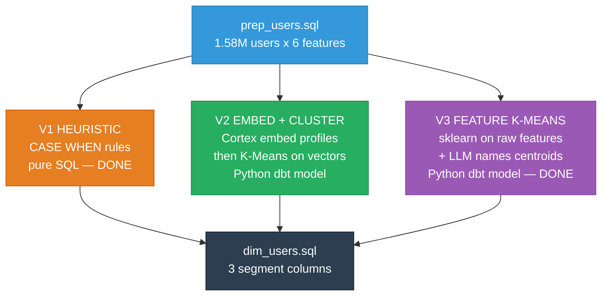

# Segmentation Architecture — Three Parallel Variants

> All three variants run in parallel from `prep_users`. Each produces `user_id → segment_name`. `dim_users` joins all three as separate dimension columns.

---

## Teammate Onboarding

```bash
# 1. Clone the repo
git clone https://github.com/Maria-Ahmed/berlin-data-ai-hackathon.git
cd berlin-data-ai-hackathon

# 2. Install tools (if not already)
brew install snowflakecli
pip install dbt-snowflake

# 3. Set up Snowflake CLI
mkdir -p ~/.snowflake
cp platforms/snowflake/connections.toml ~/.snowflake/connections.toml
# Edit ~/.snowflake/connections.toml → fill in your email + password
chmod 0600 ~/.snowflake/connections.toml
# Test: snow sql -q "SELECT 1" -c hackathon

# 4. Set up dbt
cp .env.example .env
# Edit .env → fill in your email + password
cd platforms/dbt/dbt_template
export $(cat ../../../.env | xargs)
dbt debug --profiles-dir .
# Should say "All checks passed!"

# 5. Build all existing models
dbt run --profiles-dir .
# Takes ~90s, builds 17 models into DB_TEAM_8
```

**Files that matter:**
- `platforms/snowflake/connections.toml` — Team 8 Snowflake config (account, M warehouse). Copy to `~/.snowflake/`, add your password.
- `platforms/dbt/dbt_template/profiles.yml` — dbt config. Reads `SNOWFLAKE_USER` and `SNOWFLAKE_PASSWORD` from env vars.
- `.env.example` → copy to `.env`, fill in credentials. `.env` is gitignored.
- `.user.yml` — auto-generated by dbt, gitignored. Don't copy it, dbt creates one on first run.

---

## Verified Capabilities

| Capability | Status | Timing |
|:-----------|:-------|:-------|
| Cortex COMPLETE (LLM) | ✅ | Instant for 6 calls |
| Cortex EMBED_TEXT_768 | ✅ | 50K in 79s, **~42min for 1.58M** (on XS) |
| VECTOR_COSINE_SIMILARITY | ✅ | Works |
| sklearn via `PACKAGES` clause | ✅ | v1.8.0, need explicit `PACKAGES=('scikit-learn')` |
| Python dbt model | ✅ | **Tested end-to-end, 52s for 1.58M users** |
| Snowflake ML KMeans | ⚠️ | Works but doesn't auto-normalize → bad clusters |
| **Current warehouse** | **WH_TEAM_8_M (Medium, 4x)** | Switched from XS |

---

## Overview



---

## V1: Heuristic — ✅ DONE

**File**: `prep_user_segments_heuristic.sql` (rename from current `prep_user_segments.sql`)
**Status**: Built, running. Known issue: 61% Casual Scroller.

---

## V3: Feature K-Means — ✅ DONE

**File**: `prep_user_segments_kmeans.py`
**Status**: Built, tested, produces 37/28/22/9/4% distribution. 52s on XS.

**Still needed**: profiling SQL + Cortex LLM naming (gives human-readable names to cluster 0-5).

---

## V2: Embed + Cluster — HANDOFF TO TEAMMATE

> This section is a self-contained guide. You can build V2 independently.

### What you're building

Convert each user's behavioral profile to text → embed with Cortex → K-Means on the 768-dim vectors → LLM names each cluster.

### Why embeddings on top of raw K-Means

V3 clusters on 6 hand-picked numbers. V2 clusters on 768-dimensional semantic vectors. The embedding captures relationships that raw features miss — e.g., "free Action watcher" and "ads Thriller watcher" might be semantically closer than their raw numbers suggest.

### Pipeline overview

```
prep_users (exists, 1.58M rows)
    ↓
Step 1: prep_user_profiles_text.sql    — convert features to natural language (SQL)
    ↓
Step 2: prep_user_embeddings.sql       — Cortex EMBED_TEXT_768 on profile text (SQL + Cortex)
    ↓
Step 3: prep_user_segments_embed.py    — K-Means on 768-dim vectors (Python dbt model)
    ↓
Step 4: prep_segment_profiles_embed.sql — centroid stats per cluster (SQL)
    ↓
Step 5: prep_segment_named_embed.sql   — Cortex COMPLETE names each cluster (SQL + Cortex)
    ↓
dim_users.sql joins as segment_v2_embed column
```

### Step 1: Text Profiles (SQL dbt model)

**Create file**: `models/prep/prep_user_profiles_text.sql`

```sql
-- Convert user features to natural language for embedding
-- Grain: 1 row per user_id

SELECT
    user_id,

    'Streaming user: clickout_rate=' || ROUND(COALESCE(clickout_rate, 0), 3)
    || ' (' || CASE
        WHEN clickout_rate > 0.1 THEN 'high'
        WHEN clickout_rate > 0.03 THEN 'medium'
        ELSE 'low' END || ')'

    || ', genre_entropy=' || ROUND(COALESCE(genre_entropy, 0), 2)
    || ' (' || CASE
        WHEN genre_entropy > 2 THEN 'very diverse'
        WHEN genre_entropy > 1 THEN 'moderate'
        ELSE 'specialist' END || ')'

    || ', avg_imdb=' || ROUND(COALESCE(avg_imdb_score, 0), 1) || '/10'

    || ', platforms=' || COALESCE(distinct_providers, 0)

    || ', primary_genre=' || COALESCE(primary_genre, 'unknown')

    || ', monetization=' || COALESCE(primary_monetization_type, 'unknown')

    || ', discovery=' || CASE
        WHEN search_rate > 0.1 THEN 'active_searcher'
        ELSE 'browser' END

    AS profile_text

FROM {{ ref('prep_users') }}
```

**Future enhancement**: Add top 3 genres and top 3 titles per user for richer embedding input. Requires joining events → objects → aggregating per user. Do this as V2.1 if time allows.

### Step 2: Embeddings (SQL dbt model)

**Create file**: `models/prep/prep_user_embeddings.sql`

```sql
-- Embed user profile text with Cortex
-- Grain: 1 row per user_id
-- NOTE: This takes ~10 min for 1.58M users on M warehouse
-- Materialized as TABLE so we don't re-embed on every run

{{ config(materialized='table') }}

SELECT
    user_id,
    profile_text,
    SNOWFLAKE.CORTEX.EMBED_TEXT_768('e5-base-v2', profile_text) AS embedding
FROM {{ ref('prep_user_profiles_text') }}
```

**Timing estimate on WH_TEAM_8_M**: ~10 min for 1.58M users (extrapolated: 50K in 79s on XS, M is 4x faster).

**Alternative model**: `snowflake-arctic-embed-m-v1.5` — Snowflake's own model, tested and works. May be faster on their infra. Try both:

```sql
-- To test which is faster, run on a 10K sample:
SELECT COUNT(*) FROM (
    SELECT SNOWFLAKE.CORTEX.EMBED_TEXT_768('snowflake-arctic-embed-m-v1.5', profile_text)
    FROM prep_user_profiles_text LIMIT 10000
);
```

### Step 3: Cluster Embeddings (Python dbt model)

**Create file**: `models/prep/prep_user_segments_embed.py`

```python
def model(dbt, session):
    dbt.config(
        materialized="table",
        packages=["pandas", "scikit-learn", "numpy"],
    )

    # Read embeddings
    embed_df = dbt.ref("prep_user_embeddings")
    df = embed_df.select("USER_ID", "EMBEDDING").to_pandas()

    # Convert VECTOR column to numpy array
    import numpy as np
    X = np.stack(df["EMBEDDING"].values)

    # K-Means on 768-dim vectors
    from sklearn.cluster import KMeans
    from sklearn.preprocessing import StandardScaler

    X_scaled = StandardScaler().fit_transform(X)
    km = KMeans(n_clusters=6, random_state=42, n_init=10)
    df["CLUSTER_ID"] = km.fit_predict(X_scaled)

    session.use_schema("base_prep")
    return session.create_dataframe(df[["USER_ID", "CLUSTER_ID"]])
```

**Important**: The EMBEDDING column comes back as a Snowflake VECTOR type. You may need to convert it. If `np.stack` fails, try:

```python
import json
X = np.array([json.loads(str(e)) for e in df["EMBEDDING"].values])
```

### Step 4: Profile Centroids (SQL dbt model)

**Create file**: `models/prep/prep_segment_profiles_embed.sql`

```sql
-- Per-cluster centroid stats for V2 embedding clusters
SELECT
    e.cluster_id,
    COUNT(*) AS user_count,
    ROUND(COUNT(*) * 100.0 / SUM(COUNT(*)) OVER(), 1) AS user_pct,
    ROUND(AVG(u.clickout_rate), 4) AS avg_clickout_rate,
    ROUND(AVG(u.genre_entropy), 2) AS avg_genre_entropy,
    ROUND(AVG(u.avg_imdb_score), 2) AS avg_imdb_score,
    ROUND(AVG(u.distinct_providers), 1) AS avg_providers,
    ROUND(AVG(u.search_rate), 4) AS avg_search_rate,
    MODE(u.primary_genre) AS top_genre,
    MODE(u.primary_monetization_type) AS top_monetization
FROM {{ ref('prep_user_segments_embed') }} e
JOIN {{ ref('prep_users') }} u ON e.user_id = u.user_id
GROUP BY e.cluster_id
ORDER BY user_count DESC
```

### Step 5: LLM Naming (SQL + Cortex dbt model)

**Create file**: `models/prep/prep_segment_named_embed.sql`

```sql
-- Name each V2 cluster using Cortex LLM (only 6 calls)
WITH profiles AS (
    SELECT * FROM {{ ref('prep_segment_profiles_embed') }}
),

named AS (
    SELECT
        cluster_id,
        user_count,
        user_pct,
        SNOWFLAKE.CORTEX.COMPLETE('llama3.1-70b',
            'You are naming audience segments for a streaming platform. '
            || 'Given these behavioral stats for a user cluster, provide a short creative name (2-3 words) and one sentence description. '
            || 'Stats: clickout_rate=' || avg_clickout_rate
            || ', genre_entropy=' || avg_genre_entropy
            || ', avg_imdb=' || avg_imdb_score
            || ', avg_platforms=' || avg_providers
            || ', search_rate=' || avg_search_rate
            || ', top_genre=' || top_genre
            || ', top_monetization=' || top_monetization
            || ', user_count=' || user_count
            || '. Format: Name: [name]\nDescription: [one sentence]'
        ) AS llm_output
    FROM profiles
)

-- Join back to user-level for dim_users
SELECT
    e.user_id,
    e.cluster_id,
    n.llm_output,
    -- Parse name from LLM output (first line after "Name: ")
    TRIM(SPLIT_PART(SPLIT_PART(n.llm_output, 'Name:', 2), '\n', 1)) AS segment_name
FROM {{ ref('prep_user_segments_embed') }} e
JOIN named n ON e.cluster_id = n.cluster_id
```

### Verification commands

After building all 5 files, run:

```bash
# Build the full V2 pipeline
cd repo/platforms/dbt/dbt_template
dbt run --select prep_user_profiles_text prep_user_embeddings prep_user_segments_embed prep_segment_profiles_embed prep_segment_named_embed

# Check cluster distribution
snow sql -q "SELECT cluster_id, COUNT(*) AS users FROM DB_TEAM_8.base_prep.prep_user_segments_embed GROUP BY 1 ORDER BY 2 DESC" -c hackathon

# Check LLM-generated names
snow sql -q "SELECT DISTINCT cluster_id, segment_name FROM DB_TEAM_8.base_prep.prep_segment_named_embed ORDER BY 1" -c hackathon
```

### Troubleshooting

| Problem | Fix |
|:--------|:----|
| Embedding query times out | Switch to WH_TEAM_8_M (`USE WAREHOUSE WH_TEAM_8_M`) |
| Python model fails with schema error | Add `session.use_schema("base_prep")` before `create_dataframe` |
| VECTOR column can't be read as numpy | Use `json.loads(str(e))` to parse each vector |
| LLM naming is inconsistent | Re-run — LLM output varies. Or hardcode names after first run. |
| `PACKAGES` not found | Must be exact: `PACKAGES = ('pandas', 'scikit-learn', 'numpy')` |

### Time estimates (on WH_TEAM_8_M)

| Step | Model | Estimate |
|:-----|:------|:---------|
| 1. Text profiles | SQL view | Instant |
| 2. Embeddings | SQL table (Cortex) | **~10 min** (biggest step) |
| 3. Cluster | Python dbt | ~1-2 min |
| 4. Profiles | SQL table | Seconds |
| 5. Naming | SQL + Cortex | Seconds (6 LLM calls) |
| **Total** | | **~15 min compute + ~30 min coding** |

---

## Build Status

| Model | Variant | Status | File |
|:------|:--------|:-------|:-----|
| prep_user_segments.sql | V1 | ✅ Built (rename to `_heuristic`) | `models/prep/` |
| prep_user_segments_kmeans.py | V3 | ✅ Built, 52s, good distribution | `models/prep/` |
| prep_segment_profiles.sql | V3 | ⬜ TODO | — |
| prep_segment_named.sql | V3 | ⬜ TODO | — |
| prep_user_profiles_text.sql | V2 | ⬜ TODO (handoff) | — |
| prep_user_embeddings.sql | V2 | ⬜ TODO (handoff) | — |
| prep_user_segments_embed.py | V2 | ⬜ TODO (handoff) | — |
| prep_segment_profiles_embed.sql | V2 | ⬜ TODO (handoff) | — |
| prep_segment_named_embed.sql | V2 | ⬜ TODO (handoff) | — |
| dim_users.sql | Mart | ⬜ UPDATE (join all 3) | `models/mart/` |

---

## Prerequisites Checklist

- [x] Cortex COMPLETE works
- [x] Cortex EMBED_TEXT_768 works (50K in 79s on XS)
- [x] sklearn available via PACKAGES clause (v1.8.0)
- [x] Python dbt model works end-to-end (tested, 52s)
- [x] Switched to WH_TEAM_8_M (4x compute)
- [ ] V2: Test embedding speed on M warehouse (should be ~4x faster)
- [ ] V2: Test VECTOR → numpy conversion in Python dbt model
- [ ] V3: Build profiling + LLM naming models
- [ ] Update dim_users to join all three variants
